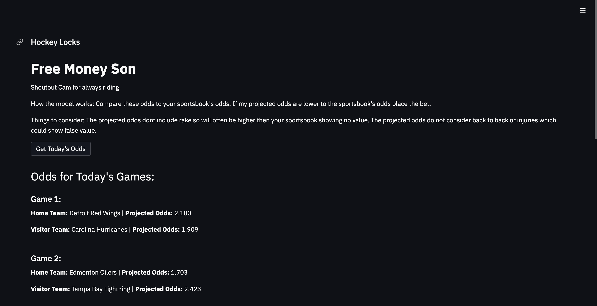

# Free Hockey Locks

## Overview
Welcome to Free Hockey Locks! This Python script, updated daily, employs a linear regression model on a unique combination of team statistics to provide insights into hockey betting lines. You can access the live app [here](https://hockeylocks.streamlit.app/).

## How the Updated Model Works
The model is dynamically updated daily and utilizes linear regression on a special combination of team statistics. Here's a brief overview of the updated model's operation:

1. **Comparison with Sportsbook Odds:** The model compares its daily updated projected odds to your sportsbook's odds.
2. **Betting Decision:** Consider placing a bet when the model's updated projected odds are lower than the sportsbook's odds.

### Important Considerations
- **Rake:** The projected odds do not include rake, potentially resulting in higher odds than your sportsbook's and showing no value.
- **Additional Factors:** While the model is updated daily, it does not consider certain factors like back-to-back games or injuries, which could affect the outcomes.

## How to Use
1. Click the "Get Today's Odds" button to view the updated projected odds for today's hockey games.
2. Click the "Get Tomorrow's Odds" button to view the updated projected odds for tomorrow's hockey games.

## Code
The Python script provided in this repository utilizes the Streamlit library for creating the web application. The model incorporates linear regression on a specialized set of team statistics for daily updates.

## Instructions for Running the App
1. Ensure you have Python and Streamlit installed.
2. Clone this repository.
3. Run the script: `streamlit run run.py`.

#
Feel free to explore, analyze, and use the insights from this tool responsibly!

**Disclaimer:** This tool is for informational purposes only and does not guarantee success in betting. Always gamble responsibly.

For any questions or feedback, please reach out to the developer.

Enjoy the Free Hockey Locks experience!